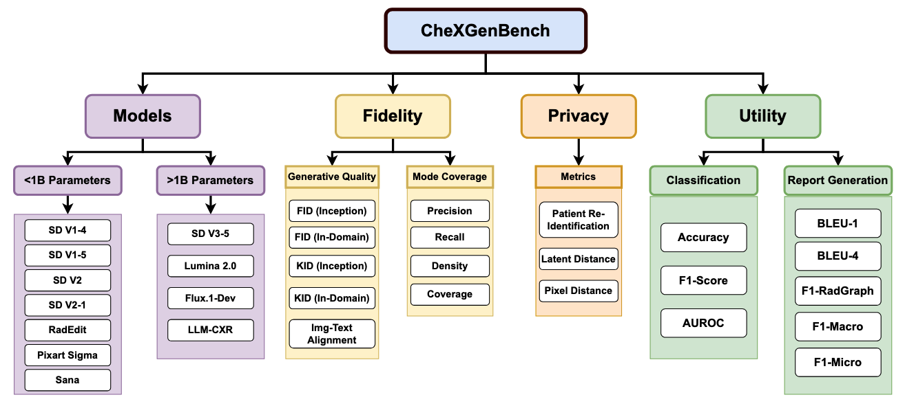
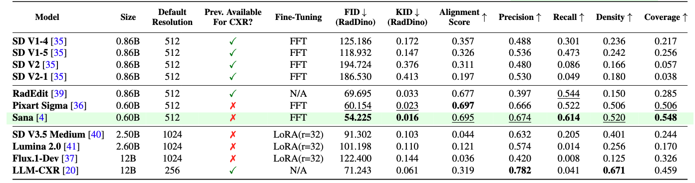
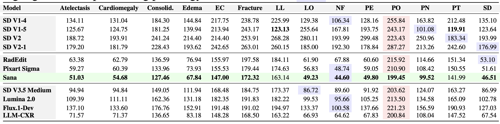
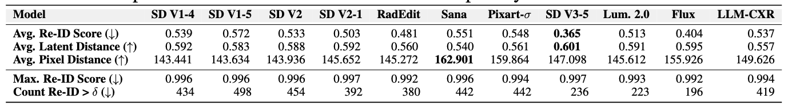

# CheXGenBench: A Unified Benchmark For Fidelity, Privacy and Utility of Synthetic Chest Radiographs



# Environment Setup
- Python>=3.10.0
- Pytorch>=2.0.1+cu12.1
```
git clone https://github.com/Raman1121/CheXGenBench.git
conda create -n myenv python=3.10
conda activate myenv
pip install -r requirements.txt
```

# Adding a New Generative Model

The benchmark currently supports SD V1.x, SD V2.x, SD V3.5, Pixart Sigma, RadEdit, Sana (0.6B), Lumina 2.0, Flux.1-Dev, LLM-CXR. 

In order to add a new model in the benchmark, follow these (easy) steps. **Note:** We assume that training of your T2I model is conducted separately from the benchmark.

- To generate images for calculating quantitative metrics (FID, KID, etc), define a new function in the `tools/generate_data_common.py` file that handles the checkpoint loading logic for the new model.

- Add a new `if` statement in the `load_pipeline` function that calls this function.

- Add the generation parameters (num_inference_steps, guidance_scale, etc) in the `PIPELINE_CONSTANTS` dictionary.

## Generating Synthetic Data (Step 0)

In order to evaluate T2I models, the first step is to generate synthetic images using a fixed set of prompts. Follow these steps to generate synthetic images to be used for evaluation.

- **Downloading Training Images:** Download the MIMIC-CXR Dataset after accepting the license from [here](https://physionet.org/content/mimic-cxr/2.0.0/).
- **Using LLaVA-Rad Annotations:** We used LLaVA-Rad Annotations because of enhanced caption quality. They are presented in the `MIMIC_Splits/` folder.
    - `cd MIMIC_Splits/`
    - `unzip llavarad_annotations.zip`
    - You will see the following CSV files
        - **Training CSV**: `MIMIC_Splits/LLAVARAD_ANNOTATIONS_TRAIN.csv`
        - **Test CSV**: `MIMIC_Splits/LLAVARAD_ANNOTATIONS_TEST.csv`

- **Data Organization:** Use the `MIMIC_Splits/LLAVARAD_ANNOTATIONS_TEST.csv` file to generate images for evaluation. Follow the steps in the previous section to use `tools/generate_data_common.py` script to generate images.
- Ensure that during generation, you save both the **original prompt** and the generated **synthetic image** in a CSV file (lets call it `prompt_INFO.csv`).
- Organize the synthetic data into a CSV file (`prompt_INFO.csv`) with the following columns:
    - `'prompt'`: Contains the text prompt used for generation.
    - `'img_savename'`: Contains the filename (or path) of the saved synthetic image.
- **File Placement:** After generating all the synthetic images and creating the CSV file:
    - Place the generated CSV file (`prompt_INFO.csv`) in the `assets/CSV` directory.
    - Place all the generated synthetic image files in the `assets/synthetic_images` directory.

# Usage

This section provides instructions on how to use the benchmark to evaluate your Text-to-Image model's synthetic data.

## Quantitative Analysis: Generation Fidelity



The quantitative analysis assesses the synthetic data at two distinct levels to provide a granular understanding of its quality:

**Overall Analysis:** This level calculates metrics across the entire test dataset, consisting of all pathologies present in the MIMIC dataset. It provides a general indication of the synthetic data's overall quality.

```bash
cd Benchmarking-Synthetic-Data
./scripts/image_quality_metrics.sh
```

**Important Note:** Calculating metrics like FID and KID can be computationally intensive and may lead to "Out of Memory" (OOM) errors, especially with large datasets (If using V100 GPUs or lower). If you encounter this issue, you can use the memory-saving version of the script:-

```bash
cd Benchmarking-Synthetic-Data
./scripts/image_quality_metrics_memory_saving.sh
```

The results would be stored in `Results/image_generation_metrics.csv`

**Image-Text Alignment** We calculate the alignment between a synthetic image and a prompt using the [Bio-ViL-T](https://huggingface.co/microsoft/BiomedVLP-BioViL-T) model. Using this requires setting up a separate environment due to different dependencies. 

1. Create a new conda environment `himl`
2. Navigate to [health-multimodal repository](https://github.com/microsoft/hi-ml) and follow the instructions to install the required dependencies in `himl`.
3. We have also provided a separate requirements file with the packages and their specific versions (untested).
 ```
conda activate himl
pip install -r requirements_himl.txt
```

**When the environment is set-up, run the following command:**

`./scripts/img_text_alignment.sh`

**Conditional Analysis:** This level calculates each metric separately for each individual pathology present in the dataset. This allows for a detailed assessment of how well the T2I model generates synthetic data for specific medical conditions.



```bash
cd Benchmarking-Synthetic-Data
./scripts/image_quality_metrics_conditional.sh
```
The results would be stored in `Results/conditional_image_generation_metrics.csv`

<div style="border: 1px solid #ccc; padding: 10px; background-color: #e7f3fe;">
  <strong>Tip:</strong> Enhance your results by providing additional information about the model or specific checkpoint used for generating the synthetic data. You can typically do this by setting the <code>EXTRA_INFO</code>argument when running the scripts (refer to the example scripts for specific usage).
</div>

## Quantitative Analysis: Privacy Metrics



- First, download the Patient Re-Identification Model from [HERE](https://huggingface.co/raman07/Patient_ReIdentification_MIMIC/blob/main/ResNet-50_epoch11_data_handling_RPN.pth) and place it in `assets/checkpoints/` folder. The name of the checkpoint is *ResNet-50_epoch11_data_handling_RPN.pth*.

- Set the appropriate paths and constants in the `scripts/privacy_metrics.sh` file.

Run the following script to calculate privacy and patient re-identification metrics.
```bash
cd Benchmarking-Synthetic-Data
./scripts/privacy_metrics.sh
```

## Quantitative Analysis: Downstream Utility

### Image Classification

For image classification, we used 20,000 samples from the MIMIC Dataset for training. To evaluate, you first need to generate synthetic samples using the same 20,000 prompts with your T2I Model. 

```
cd MIMIC_Splits/Downstream_Classification_Files
unzip training_data_20K.zip
```

- You can use the `tools/generate_data_common.py` file to generate synthetic images.
- During generation, save the synthetic images in a folder (let's say `SYNTHETIC_IMAGES`)
- To run image classification using these images, 
    - `cd Downstream/Classification`
    - Set the paths in `/scripts/run_training_inference.sh`
    - Run `./scripts/run_training_inference.sh`

### Radiology Report Generation

To fine-tune LLaVA-Rad, the first step is creating a *new* environment following the steps mentioned in the official [LLaVA-Rad repository](https://github.com/microsoft/LLaVA-Rad).